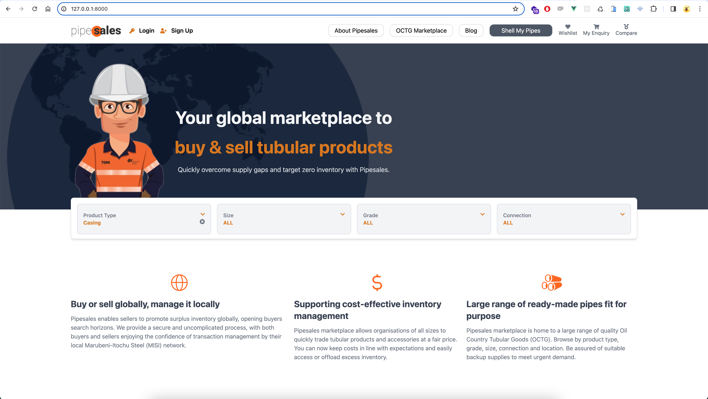
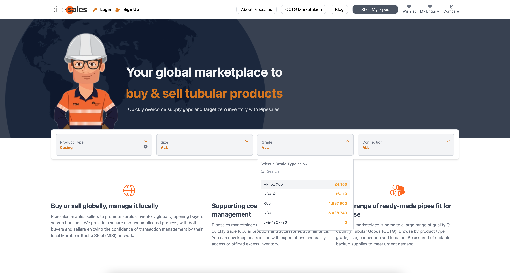

# Frontend Engineer Test - PT. INOSOFT TRANS SISTEM

### Technologies Stack 
- PHP 8
- Laravel v.8
- Node.js > v.v12.22.12
- Vue 2
- Vuex
- TailwindCSS
- Jest
- Vue Test Utils

### How to Install Backend
- $ composer install
- $ php artisan key:generate

### For runing APP Laravel 
- $ php artisan serve

### How to Install Frontend
- $ npm install | yarn install 

### For runing APP Vue
- $ npm run watch

### How to run unit test
- $ npm run test

## Result Screenshot Project 

Homepage

Homepage Filter Select

 
 
 
hopefully we can work together
 
 
 

Thank you 
 
Fathan Rohman - karir.fathan@gmail.com